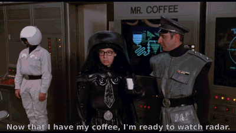

# Automatic target recognition of Space Invaders
[](https://codeclimate.com/github/FlintOFF/space_invaders/maintainability)

This is my realization for test task "SPACE INVADERS".
You can read full description for this task in the file [TASK.md](TASK.md).

#### Requirements:

* Ruby/Rails versions
    * ruby ~> '2.5.1'
    * rails ~> '5.2.1'

* System dependencies
    * postgresql 9.6

## Install
* `git clone git@github.com:FlintOFF/space_invaders.git`
* `cd space_invaders`
* `rm config/credentials.yml.enc`
* `EDITOR=nano rails credentials:edit`
* `cp config/database.yml.sample config/database.yml`
* `nano config/database.yml`
* `./bin/setup`
* `rake tasks:handle`
* `rails s`

## Deploy to Heroku
```
git push heroku master
heroku config:set RAILS_MASTER_KEY=<your-master-key-here>
heroku run rake db:setup
```

## Test
* For run all tests `rails test`
* For test manually over heroku:
    * generate token `curl -d '{"email": "smstur@gmail.com", "password": "super_password"}' -H "Content-Type: application/json" -X POST https://space-invaders-atr.herokuapp.com/tokens`
    * get task result `curl -H "Authorization: Bearer <token>" -H "Content-Type: application/json" https://space-invaders-atr.herokuapp.com/tasks/1`
    
## Other
* Swagger documentation is available by [link](https://space-invaders-atr.herokuapp.com/swagger_doc)
